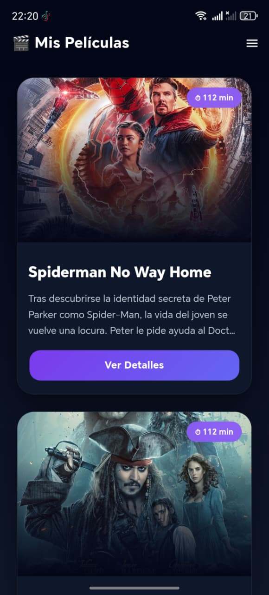
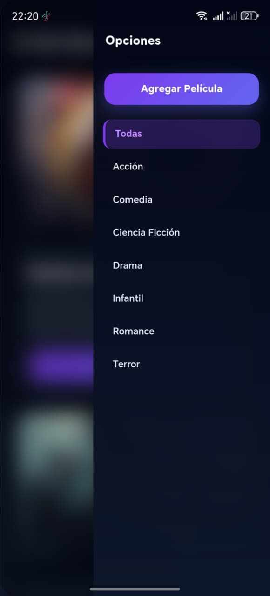
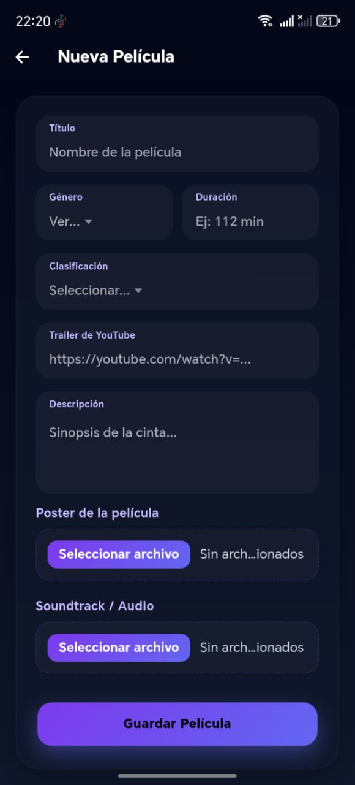
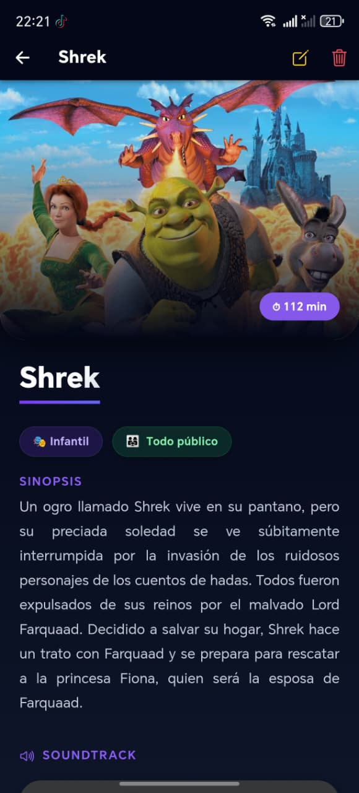
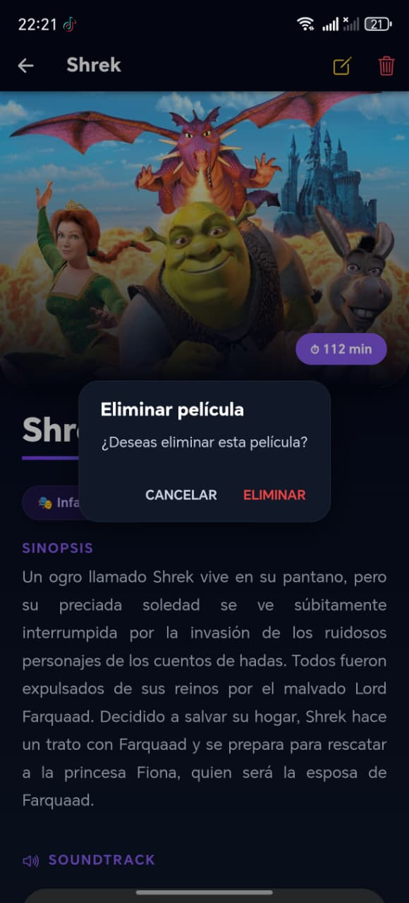

# 🎬 Aplicación Móvil de Películas

## 👨‍💻 Estudiante

**Emily Alejandra Galeas Tingo**

---

# 📌 Descripción del Proyecto

Aplicación móvil desarrollada con **Ionic + Angular** utilizando **Supabase** como backend y almacenamiento multimedia.

La aplicación permite administrar un catálogo de películas mediante operaciones CRUD completas, incluyendo:

* Crear películas
* Editar películas
* Eliminar películas
* Visualizar detalles
* Filtrar películas por género
* Subir imágenes al Storage
* Subir audios al Storage
* Reproducir trailers
* Reproducir soundtracks

Además, cuenta con una interfaz moderna inspirada en plataformas de streaming.

---

# 🛠️ Tecnologías Utilizadas

## Frontend

* Ionic Framework
* Angular
* TypeScript
* SCSS
* HTML

## Backend y Base de Datos

* Supabase
* PostgreSQL
* Supabase Storage

## Herramientas

* Capacitor
* Android Studio
* Visual Studio Code

---

# 📱 Funcionalidades Implementadas

## ✅ Gestión de Películas (CRUD)

La aplicación permite:

### Crear películas

Se pueden registrar películas con:

* Título
* Género
* Duración
* Clasificación
* Descripción
* Imagen
* Trailer
* Audio

---

### Editar películas

Los registros pueden modificarse posteriormente.

---

### Eliminar películas

La aplicación muestra una alerta de confirmación antes de eliminar una película.

---

### Visualizar detalles

Cada película cuenta con una vista detallada donde se muestra:

* Banner principal
* Información general
* Clasificación
* Género
* Duración
* Descripción
* Reproductor de audio
* Reproductor de video

---

# 🎵 Multimedia

## 📸 Subida de Imágenes

Las imágenes son seleccionadas desde el dispositivo móvil y posteriormente almacenadas en Supabase Storage.

La URL generada automáticamente se guarda en la base de datos.

---

## 🎧 Subida de Audios

Los audios también son seleccionados desde el dispositivo móvil y almacenados en Supabase Storage.

La URL pública es almacenada automáticamente.

---

## ▶️ Reproducción de Trailer

La aplicación soporta:

* Links de YouTube
* Links embed
* Videos externos

Además, se transforman automáticamente enlaces normales de YouTube a formato embed.

---

# 🎨 Diseño de la Aplicación

La interfaz fue diseñada utilizando:

* Glassmorphism
* Gradientes oscuros
* Badges dinámicos
* Sombras modernas
* Bordes redondeados
* Diseño responsive

Inspirada visualmente en plataformas como:

* Netflix
* HBO Max
* Disney+

---

# 🧠 Clasificación Dinámica

La clasificación de las películas cambia visualmente según el rango de edad:

| Clasificación               | Estilo   |
| --------------------------- | -------- |
| Todo público                | Verde    |
| 12 años / 13 años           | Amarillo |
| 15 años / 16 años / 18 años | Rojo     |

Además, se utilizan emojis dinámicos:

* 👨‍👩‍👧 Todo público
* ⚠️ Adolescentes
* 🔞 Adultos

---

# 🎬 Filtro por Género

La aplicación incluye un menú lateral donde se puede filtrar el catálogo por género:

* Acción
* Comedia
* Drama
* Terror
* Ciencia ficción
* Infantil
* Romance

---

# 📂 Estructura de la Base de Datos

## Tabla: peliculas

```sql
create table peliculas (
  id bigint generated always as identity primary key,
  titulo text not null,
  genero text not null,
  duracion text not null,
  clasificacion text,
  descripcion text,
  imagen_url text,
  video_url text,
  audio_url text,
  created_at timestamp with time zone default now()
);
```

---

# ☁️ Supabase Storage

Se utilizaron buckets para almacenar:

## Bucket de imágenes

* posters

## Bucket de audios

* audios

Los archivos son subidos automáticamente desde la aplicación móvil.

---

# 🔐 Permisos Android

Para acceder a imágenes y audios del dispositivo se agregaron permisos en AndroidManifest.xml:

```xml
<uses-permission android:name="android.permission.READ_EXTERNAL_STORAGE"/>
<uses-permission android:name="android.permission.READ_MEDIA_IMAGES"/>
<uses-permission android:name="android.permission.READ_MEDIA_AUDIO"/>
```

---

# 🔔 Notificaciones

La aplicación muestra notificaciones tipo Toast para:

* Película creada
* Película actualizada
* Película eliminada

---

# 🚀 Instalación del Proyecto

## 1. Clonar repositorio

```bash
git clone URL_DEL_REPOSITORIO
```

---

## 2. Instalar dependencias

```bash
npm install
```

---

## 3. Ejecutar proyecto

```bash
ionic serve
```

---

## 4. Ejecutar en Android

```bash
ionic build
npx cap sync android
npx cap open android
```

---

# 📦 Dependencias Principales

```bash
npm install @supabase/supabase-js
npm install @capacitor/android
```

---

# 📷 Evidencias

| 🏠 Inicio | 📂 Menú | ➕ Agregar | 🎬 Detalle | 🗑️ Eliminar |
|---|---|---|---|---|
|  |  |  |  |  |

---

# 🎥 Video de Funcionamiento

🔗 

# 📚 Aprendizajes Obtenidos

Durante el desarrollo de este proyecto se reforzaron conocimientos relacionados con:

* Ionic Framework
* Angular
* TypeScript
* Consumo de servicios
* CRUD
* Manejo de formularios
* Manejo de rutas
* Supabase
* PostgreSQL
* Storage en la nube
* Multimedia en aplicaciones móviles
* Diseño UI/UX
* Compilación Android

---

# ✅ Conclusión

La aplicación desarrollada cumple correctamente con los requerimientos planteados para el taller de aplicaciones móviles.

Se implementó un sistema completo de administración de películas utilizando tecnologías modernas y una interfaz visual atractiva.

Además, se logró integrar almacenamiento multimedia en la nube, reproducción de contenido y funcionalidades avanzadas propias de una aplicación móvil real.
